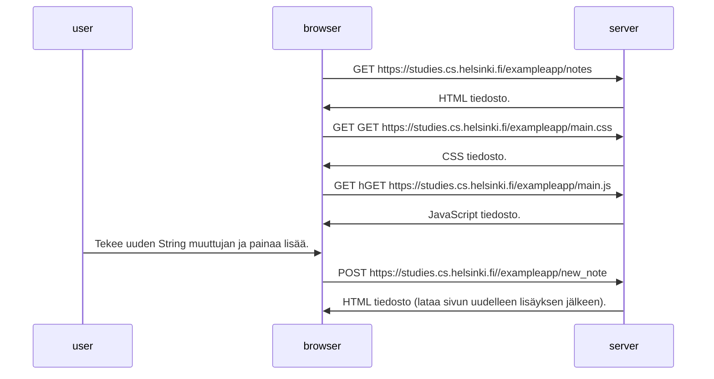

```mermaid
sequenceDiagram
    participant user
    participant browser
    participant server
    browser ->>server: GET https://studies.cs.helsinki.fi/exampleapp/notes
    server ->>browser: HTML tiedosto.
    browser ->>server: GET GET https://studies.cs.helsinki.fi/exampleapp/main.css
    server ->>browser: CSS tiedosto.
    browser ->>server: GET hGET https://studies.cs.helsinki.fi/exampleapp/main.js
    server ->>browser: JavaScript tiedosto.
    user ->>browser: Tekee uuden String muuttujan ja painaa lisää.
    browser ->>server: POST https://studies.cs.helsinki.fi//exampleapp/new_note
    server ->>browser: HTML tiedosto (lataa sivun uudelleen lisäyksen jälkeen).
```
