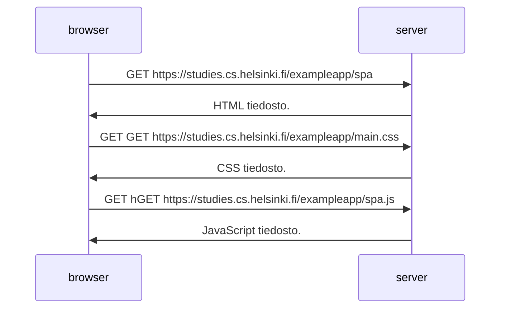

## Tehtävä 5

Tehtävä 5 kuvaa miten single app sivusto ladataan auki (tiedon liikkuminen selaimen ja serverin välillä).

```mermaid
sequenceDiagram
    participant browser
    participant server
    browser ->>server: GET https://studies.cs.helsinki.fi/exampleapp/spa
    server ->>browser: HTML tiedosto.
    browser ->>server: GET GET https://studies.cs.helsinki.fi/exampleapp/main.css
    server ->>browser: CSS tiedosto.
    browser ->>server: GET hGET https://studies.cs.helsinki.fi/exampleapp/spa.js
    server ->>browser: JavaScript tiedosto.
```
