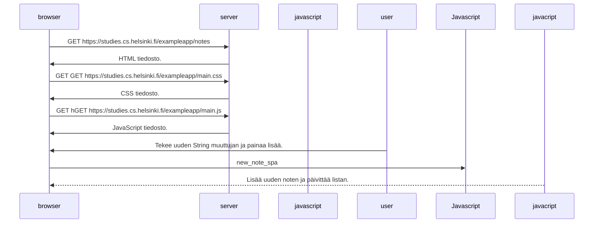

## Tehtävä 6

Tehtävä 6 kuvaa miten tieto liikkuu single app sovelluksessa kun listalle lisätään uusi String elementti. Sivu ei lataudu uudelleen
kuten perinteisissä versioissa. Sen sijaan javascript päivittää listan ja lataa sen uudelleen.

